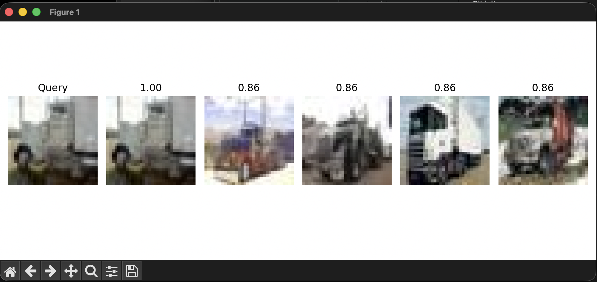

🖼 AI Image Similarity Search Engine

📌 Overview

This project implements an AI-powered Image Similarity Search System using Deep Learning (CNN).

Instead of classifying images, the system finds visually similar images based on their feature representations (embeddings) extracted using a pretrained neural network.

⸻

🎯 Objective

Given a query image, the system retrieves the top similar images from a dataset.
Query Image → Feature Extraction → Similarity Comparison → Top Matches

🧠 Key Concept

🔹 Image Embeddings

A pretrained CNN (ResNet18) converts images into numerical feature vectors:
Image → [0.12, 0.98, 0.33, ...]

Similar images produce similar vectors, enabling comparison.

⸻

🏗 Project Structure
image-search-engine
│
├── dataset/               # Image dataset
├── features.npy           # Extracted feature vectors
├── paths.npy              # Image file paths
├── model.py               # CNN model (ResNet18)
├── extract_features.py    # Feature extraction script
├── search.py              # Similarity search + UI display
└── README.md

⚙️ Technologies Used
	•	Python
	•	PyTorch
	•	Torchvision
	•	NumPy
	•	Scikit-learn
	•	Matplotlib
	•	PIL

⸻

🔍 How It Works

1️⃣ Feature Extraction
	•	Images are passed through a pretrained ResNet18
	•	The final classification layer is removed
	•	Output is a feature vector (embedding)

2️⃣ Similarity Computation
	•	Uses Cosine Similarity
	•	Compares query image vector with dataset vectors

3️⃣ Image Retrieval
	•	Retrieves Top 5 similar images
	•	Displays them visually

⸻

▶️ How to Run

Install dependencies
pip install torch torchvision numpy pillow matplotlib scikit-learn

Step 1 — Extract Features
python extract_features.py

Step 2 — Run Search
python search.py

🖼 Output

The system displays:
	•	Query image
	•	Top 5 similar images
	•	Similarity scores
    [Query] → [Top Matches with similarity scores]

📊 Results

The model successfully retrieves visually similar images using feature embeddings.
Even with a small dataset, the system demonstrates strong similarity matching.